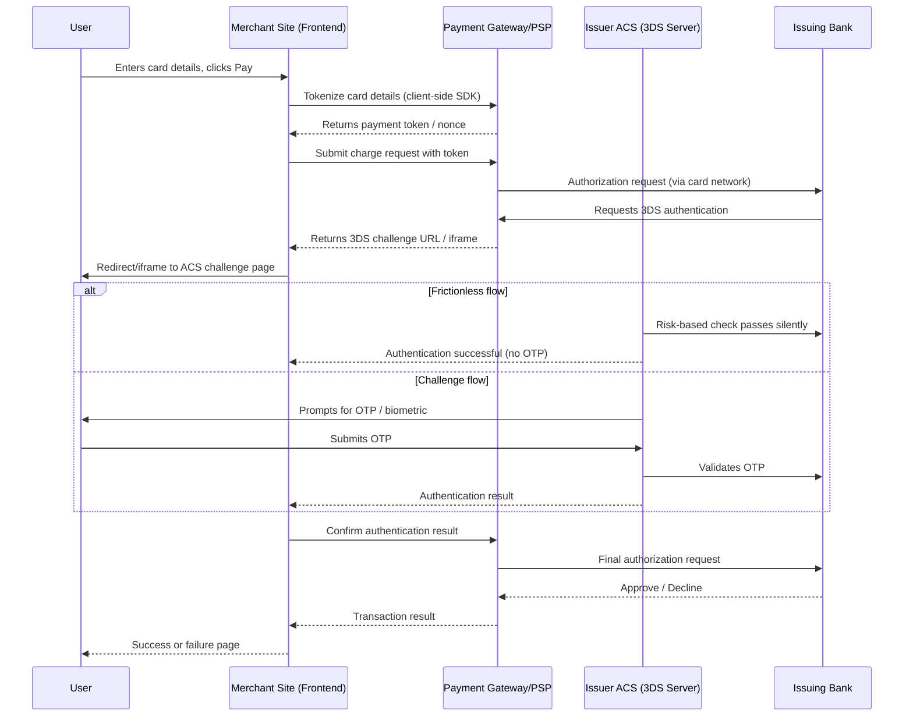

# End-to-End Flow: Card Transaction with 3D Secure (3DS)

## Diagram

## Explanation

**1. Frontend initiation.** The user enters card details on the
merchant's checkout page. Card data should never touch the merchant's
own servers unencrypted — instead, the merchant's frontend uses a PSP
SDK (Stripe.js, Braintree, Razorpay Checkout, etc.) to collect the
card fields directly, keeping the merchant out of PCI-DSS scope.

**2. Tokenization.** The PSP SDK sends card details straight to the
PSP's servers over TLS and receives back a single-use token/nonce
representing that card. The merchant's backend only ever sees this
token, never the raw PAN (card number).

**3. Authorization request.** The merchant's backend sends the token
plus the charge amount to the PSP's API. The PSP forwards this to the
card network (Visa/Mastercard/etc.), which routes it to the issuing
bank.

**4. 3DS challenge flow.** The issuing bank's Access Control Server
(ACS) decides, based on risk scoring, whether the transaction needs
active authentication:
- **Frictionless flow:** The ACS is confident enough (device
  fingerprint, transaction history, risk score) to approve silently —
  no user interaction required.
- **Challenge flow:** The ACS redirects the user (via an iframe or
  full-page redirect) to a bank-hosted page requesting an OTP sent by
  SMS, a banking app approval, or biometric confirmation.

**5. API involvement.** Throughout this flow, the merchant's backend
and the PSP exchange authentication results and final authorization
status via server-to-server API calls — the merchant polls or
receives a webhook/callback once the ACS challenge resolves.

**6. Success/failure handling.** On success, the PSP returns an
authorization code, and the merchant marks the order as paid and
triggers fulfillment. On failure (OTP mismatch, timeout, declined
by issuer), the PSP returns a decline reason, and the merchant should
present a clear, actionable error to the user (e.g. "authentication
failed, try again" vs. "insufficient funds") rather than a generic
failure message, and should not retry silently with the same card
without user re-confirmation.

**Key QA angles to test:** frictionless vs. challenge routing,
OTP timeout/retry limits, browser back-button behavior mid-challenge,
webhook/callback idempotency (duplicate success events), and
session/token expiry between charge initiation and challenge
completion.
